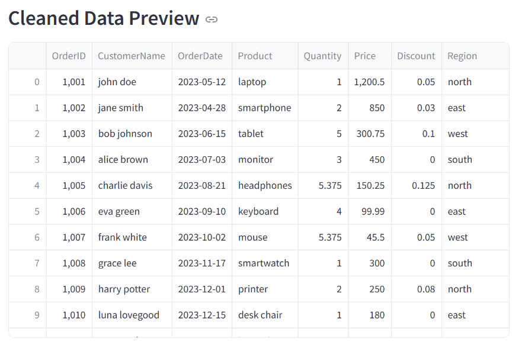
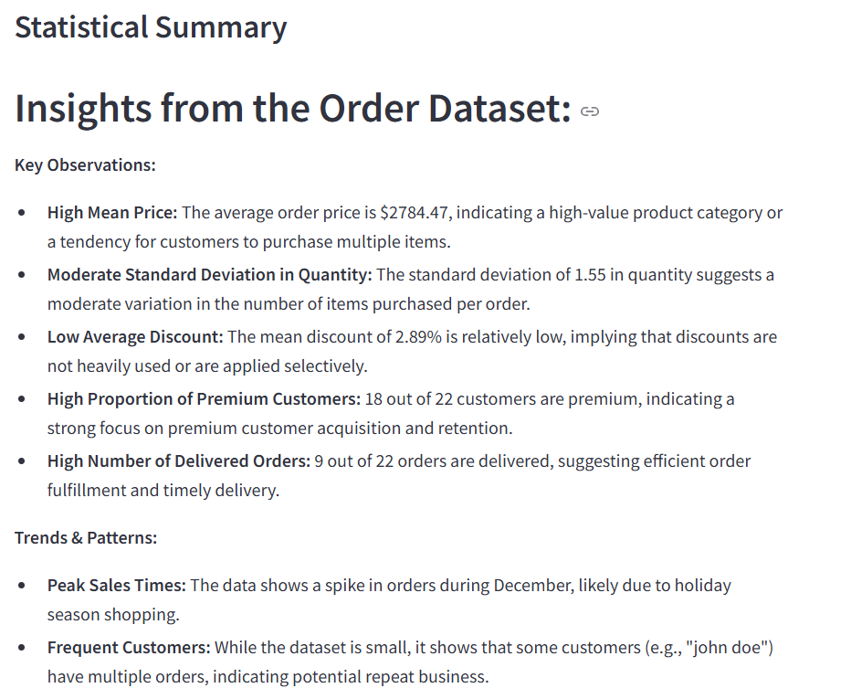
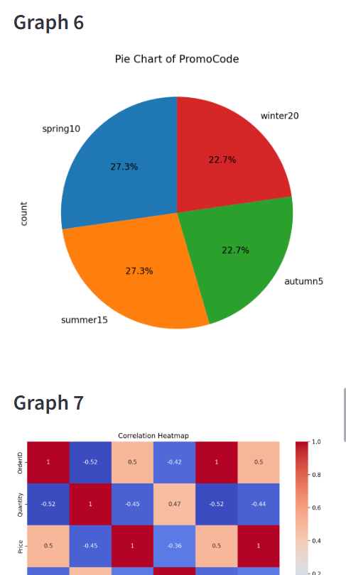
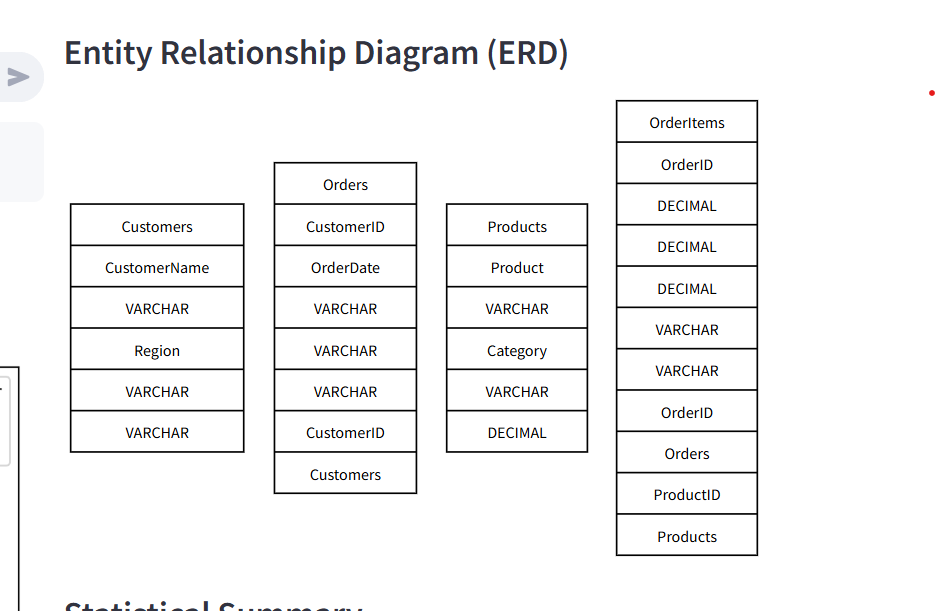
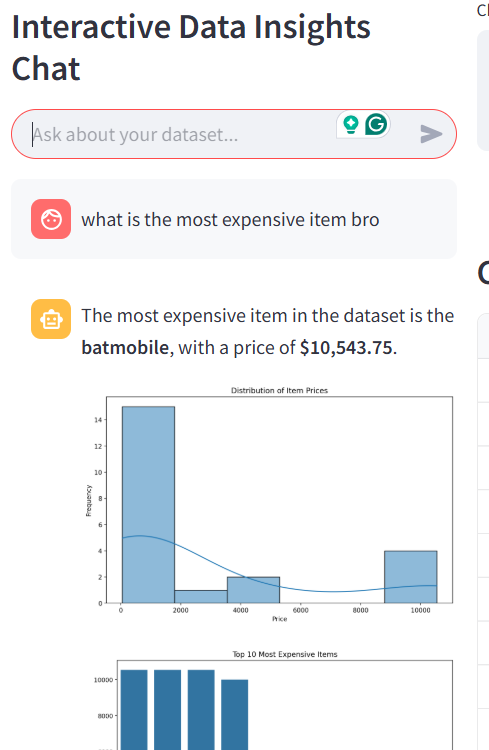

# Automated Data Science Platform

This project is an automated data science platform designed to streamline data cleaning, statistical analysis, and visualization using advanced machine learning models and tools. The platform leverages LangGraph, LangChain, and other libraries to provide a comprehensive solution for data analysis.

## Features

- **Data Cleaning**: Automatically handle missing values, detect and remove duplicates, normalize text columns, convert date columns, and handle outliers.

- **Statistical Analysis**: Generate detailed statistical summaries, including descriptive statistics, correlation matrices, skewness, kurtosis, and outlier detection.


- **Data Visualization**: Suggest and generate various chart types to visualize the dataset effectively.

- **Entity Relationship Diagram (ERD)**: Generate ERDs from SQL schema.

- **Interactive Chat**: Ask questions about your dataset and get insights through an interactive chat interface.


## Setup

### Prerequisites

- Docker
- Docker Compose
- Google gemini key (because it is cheap, don't ask)

### Installation

1. Clone the repository:

    ```bash
    git clone ...
    cd data_analyzer/auto_ds
    ```

2. Create a `.env` file in the root directory and add your API keys:

    ```plaintext
    GOOGLE_API_KEY=your_google_api_key_here
    ```

### Running the Application

1. Build and start the Docker containers:

    ```bash
    docker-compose up --build
    ```

2. Access the Streamlit frontend:

    Open your browser and go to `http://localhost:8501`

3. The backend FastAPI server will be running at:

    `http://localhost:5000`

### Usage

#### Uploading a Dataset

1. Go to the upload section and choose a CSV to upload or use test.csv data.
2. The platform will process the data, clean it, and provide a preview of the cleaned data.
3. It will also generate a statistical summary, ERD, and various visualizations.
4. Be patient as this process may take some time.

#### Interactive Chat

1. Use the chat interface to ask questions about your dataset.
2. The platform will analyze your query and provide insights based on the data.
3. Ensure you have uploaded a file before using the chat feature.

## Acknowledgements

- [LangGraph](https://github.com/langchain-ai/langgraph)
- [LangChain](https://github.com/langchain-ai/langchain)
- [Tavily](https://tavily.com/)
- [Anthropic](https://console.anthropic.com/)
- [OpenAI](https://platform.openai.com/)
